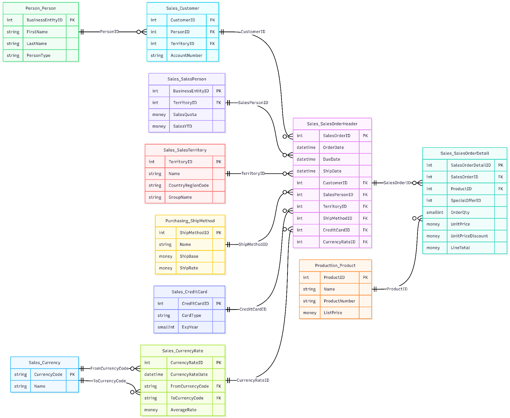
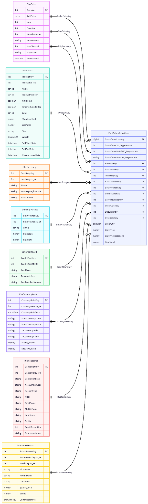

# AdventureWorks Sales BI Platform

A full-stack academic and portfolio project that combines an OLTP e-commerce API, an Angular frontend, an AdventureWorks-based sales data warehouse, and an SSIS ETL pipeline.

## Prepared by

- **Youssef Ben Abdallah**
- **Mariem Ben Slim**

## Repository modules

1. **backend/Ecom.Api** — ASP.NET Core Web API (.NET 9) for authentication, catalog management, orders, and analytics endpoints.
2. **frontend/ecom-ui** — Angular 17 client for customer flows and admin dashboards.
3. **AW_Sales_DW_ETL** — SSIS project that loads dimensions and fact data into `AdventureWorksDW_Sales`.
4. **Database** — SQL scripts for warehouse tables, stored procedures, and reporting views.
5. **quality-assurance** — QA assets, test design, traceability, and execution documentation.
6. **docs** — repository documentation, structure notes, API reference, and diagrams.

## GitHub-ready improvements included

This package was cleaned and prepared for GitHub publication with:

- build artifacts removed (`bin/`, `obj/`, `.vs/`, generated SSIS outputs)
- improved repository-level `.gitignore`
- normalized Git metadata files (`.gitattributes`)
- GitHub Actions CI workflow for backend and frontend builds
- repository authorship files (`AUTHORS.md`, `CITATION.cff`)
- safer backend config template (`appsettings.example.json`)
- refreshed repository documentation for clean cloning and setup

## Repository structure

```text
AdventureWorks/
├─ backend/
│  ├─ Ecom.sln
│  └─ Ecom.Api/
├─ frontend/
│  └─ ecom-ui/
├─ AW_Sales_DW_ETL/
├─ Database/
├─ quality-assurance/
├─ docs/
├─ .github/workflows/
├─ AUTHORS.md
├─ CITATION.cff
├─ .gitattributes
└─ README.md
```

A more detailed tree is available in [`docs/PROJECT_STRUCTURE.md`](docs/PROJECT_STRUCTURE.md).

## Architecture summary

- The **backend API** manages authentication, categories, subcategories, products, carts, and orders.
- The **Angular frontend** consumes the API and exposes both customer and admin experiences.
- The **analytics layer** reads from a dedicated SQL Server warehouse database: `AdventureWorksDW_Sales`.
- The **SSIS ETL pipeline** loads the warehouse using AdventureWorks source data.
- The **QA module** documents tests, traceability, static analysis, and execution evidence.

## Included diagrams

### Source model



### Star schema



## Prerequisites

### General
- Git
- Windows recommended for the backend + SSIS workflow
- SQL Server / SQL Server Developer / SQL Server Express

### Backend
- .NET 9 SDK

### Frontend
- Node.js 18.19+ or Node.js 20 LTS
- npm

### ETL / Warehouse
- Visual Studio 2022
- SQL Server Data Tools / SSIS extension

## Quick start

### 1) Backend API

```bash
cd backend/Ecom.Api
dotnet restore
dotnet ef database update
dotnet run
```

Default local endpoints:
- HTTPS: `https://localhost:57240`
- HTTP: `http://localhost:57241`
- Swagger: `https://localhost:57240/swagger`

### 2) Frontend Angular app

```bash
cd frontend/ecom-ui
npm install
npm start
```

### 3) ETL project

Open the solution:
- `AW_Sales_DW_ETL/AW_Sales_DW_ETL.slnx`

Run packages in this order:
1. `01_Load_Dimension.dtsx`
2. `02_Load_FactSales.dtsx`

## Configuration notes

### Backend configuration

The project includes a development-safe default `appsettings.json` and a publishable template at:
- `backend/Ecom.Api/appsettings.example.json`

Before sharing outside development, review:
- connection strings
- JWT settings
- seeded admin credentials
- image storage path

### Product images

The API serves product images from:
- `C:\images\product`

Create that folder locally or adjust the path in configuration.

## GitHub publication checklist

Before pushing to GitHub:

1. Create a new empty repository on GitHub.
2. Extract this cleaned project.
3. Run:
   ```bash
   git init
   git add .
   git commit -m "Initial commit"
   git branch -M main
   git remote add origin <your-repository-url>
   git push -u origin main
   ```
4. Update the repository description and add screenshots if desired.
5. Add collaborators if both authors will maintain the repo.

## Documentation index

- [`AUTHORS.md`](AUTHORS.md)
- [`docs/README.md`](docs/README.md)
- [`docs/PROJECT_STRUCTURE.md`](docs/PROJECT_STRUCTURE.md)
- [`docs/api/API_REFERENCE.md`](docs/api/API_REFERENCE.md)
- [`backend/README.md`](backend/README.md)
- [`backend/Ecom.Api/README.md`](backend/Ecom.Api/README.md)
- [`frontend/README.md`](frontend/README.md)
- [`frontend/ecom-ui/README.md`](frontend/ecom-ui/README.md)
- [`AW_Sales_DW_ETL/README.md`](AW_Sales_DW_ETL/README.md)
- [`quality-assurance/README.md`](quality-assurance/README.md)

## Important note

This package is prepared for **GitHub repository publication**. It is not a production deployment bundle. Before deploying the application to a real server, review secrets management, CORS, hosting configuration, environment variables, and database provisioning.
